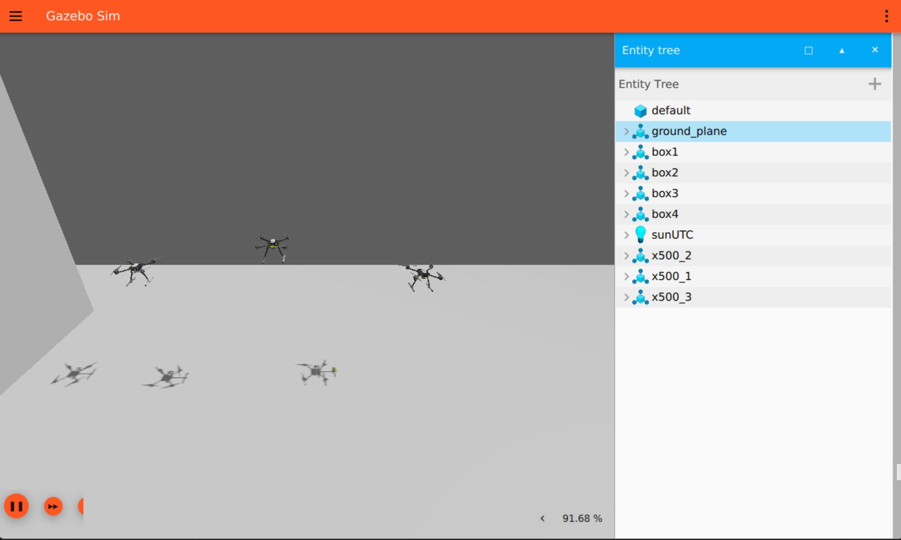

# PX4 Multi-Drone Simulation Project

This project is designed to simulate and control multiple drones in a PX4-based simulation environment. The system allows for the integration of various drone types, trajectory planning using G-codes, and interaction via ROS 2 for advanced multi-agent robotics systems.

  
---

  

  


## Overview
This project provides a modular and extensible framework for simulating drones in a PX4-based environment. Key components include:
- **Drone controllers** for managing the logic and behavior of drones.
- **G-code implementation** for defining drone trajectories and actions.
- **Dockerized environment** for consistent setup and deployment.
- **Multi-drone message protocols** for inter-drone communication and state management.
- 
## Project Status
**This project is currently under active development.**  
New features, improvements, and bug fixes are being added regularly. Contributions and feedback are welcome to help refine and expand the system further.

---

## Features

- **G-Code System**: 
  - Supports commands like linear motion, circular interpolation, takeoff, landing, etc.
  - Easily extendable for custom drone actions.
- **Multi-Drone Simulation**:
  - Simulate and control multiple drones simultaneously.
  - Real-time state monitoring and command execution.
- **ROS2 Integration**:
  - Full compatibility with ROS2 for node-based drone control.
  - Custom message types for inter-drone communication.
- **Docker Support**:
  - Simplifies setup and deployment of the simulation environment.
- **Extensible Controllers**:
  - Base classes for creating custom drone types (e.g., X500, R1 Rover).

---

## Getting Started

### Dependencies

#### **Required:**
1. **ROS 2 Humble** (on Ubuntu 22.04)  
   Install via [official guide](https://docs.ros.org/en/humble/Installation.html).

2. **PX4 v1.14**  
   Clone and checkout:
   ```bash
   git clone https://github.com/PX4/PX4-Autopilot.git
   cd ./PX4-Autopilot
   git checkout v1.14.4
   git submodule sync --recursive
   git submodule update --init --recursive
   ```

3. **px4_msgs v1.14**  
   ```bash
    git clone https://github.com/PX4/px4_msgs.git
    cd px4_msgs
    git checkout release/1.14
   ```

4. **Docker**  
   Install via [Docker guide](https://docs.docker.com/get-docker/).

5. **Python Libraries**  
   ```bash
   pip install scipy numpy
   ```

---

### **Optional:**
1. **Terminal Emulator:**  
   `gnome-terminal`, `xterm`, or `konsole` for PX4 SITL.  

2. **X Server for Docker Visualization:**  
   Use XLaunch (Windows), XQuartz (macOS), or `xhost` on Linux for GUI support in Docker.  
   Enable X11 forwarding:  
   ```bash
   xhost +local:docker
   ```

### Building the Environment
1. Clone the repository:
   ```bash
   git clone https://github.com/AntonSHBK/px4_multi_drone_sim.git
   cd px4_multi_drone_sim
   ```
2. Build the Docker container:
   ```bash
   docker-compose up --build
   ```
3. Launch the simulation:
   ```bash
   colcon build --packages-select px4_msgs
   colcon build --packages-select multi_drone multi_drone_msg
   ros2 launch multi_drone test_run.launch.py
   ```

---

## Usage

### Fast Commands
Refer to `fast_commands.md` for a list of quick commands and their descriptions.

---

## Contributing
We welcome contributions! Feel free to open issues or submit pull requests.

---

## Contacts

For questions or support, please contact:

- **Name**: Pisarenko Anton
- **Email**: anton42@yandex.ru
- **Telegram**: [antonSHBK](https://t.me/antonSHBK)
